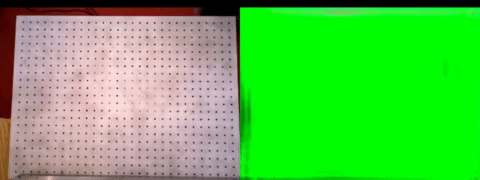

## Dense Correspondence Learning in PyTorch

In this project we learn Dense Object Nets, i.e. dense descriptor networks for previously unseen, potentially deformable objects, and potentially classes of objects:

  |   | 
:-------------------------:|:-------------------------:|:-------------------------:

We also demonstrate using Dense Object Nets for robotic manipulation tasks:

  |  
:-------------------------:|:-------------------------:

### Dense Object Nets: Learning Dense Visual Descriptors by and for Robotic Manipulation

This is the reference implementation for our paper:

[PDF](https://arxiv.org/pdf/1806.08756.pdf) | [Video](https://youtu.be/rUk85st9QNE)

<em><b>Abstract:</b></em> What is the right object representation for manipulation? We would like robots to visually perceive scenes and learn an understanding of the objects in them that (i) is task-agnostic and can be used as a building block for a variety of manipulation tasks, (ii) is generally applicable to both rigid and non-rigid objects, (iii) takes advantage of the strong priors provided by 3D vision, and (iv) is entirely learned from self-supervision.  This is hard to achieve with previous methods: much recent work in grasping does not extend to grasping specific objects or other tasks, whereas task-specific learning may require many trials to generalize well across object configurations or other tasks.  In this paper we present Dense Object Nets, which build on recent developments in self-supervised dense descriptor learning, as a consistent object representation for visual understanding and manipulation. We demonstrate they can be trained quickly (approximately 20 minutes) for a wide variety of previously unseen and potentially non-rigid objects.  We additionally present novel contributions to enable multi-object descriptor learning, and show that by modifying our training procedure, we can either acquire descriptors which generalize across classes of objects, or descriptors that are distinct for each object instance. Finally, we demonstrate the novel application of learned dense descriptors to robotic manipulation. We demonstrate grasping of specific points on an object across potentially deformed object configurations, and demonstrate using class general descriptors to transfer specific grasps across objects in a class. 

#### Citing

If you find this code useful in your work, please consider citing:

```
@article{florencemanuelli2018dense,
  title={Dense Object Nets: Learning Dense Visual Object Descriptors By and For Robotic Manipulation},
  author={Florence, Peter and Manuelli, Lucas and Tedrake, Russ},
  journal={arXiv preprint arXiv:1806.08756},
  year={2018}
}
```

  
### Code Setup

- [building with docker](doc/docker_build_instructions.md)
- [recommended docker workflow ](doc/recommended_workflow.md)


### Dataset

- [data organization](doc/data_organization.md)
- [data processing for a single scene](doc/data_processing_single_scene.md)
- [data processing in batch](doc/data_processing_batch.md)


### Dense Object Nets
- [recommended docker workflow ](doc/recommended_workflow.md)
- [training a network](doc/training.md)
- [evaluating a trained network](doc/dcn_evaluation.md)


### Miscellaneous
- [coordinate conventions](doc/coordinate_conventions.md)
- [testing](doc/testing.md)

### Tutorials

*Coming soon*

### Git management

To prevent the repo from growing in size, recommend always "restart and clear outputs" before committing any Jupyter notebooks.  If you'd like to save what your notebook looks like, you can always "download as .html", which is a great way to snapshot the state of that notebook and share.
